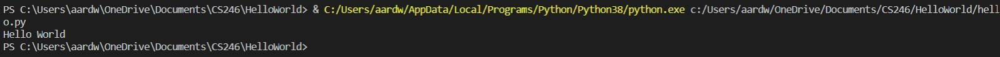

# Hello World Program

Author, Conner Pohlsander

## Overview

This program very simply prints "Hello World" using the programming language Python. This is often times the first thing somebody learns to do when they start learning how to code. This code was pushed to GitHub and written using Visual Studio Code.

## Development Enviroment

* Python 8.3.2
* Visual Studio Code

## Execution

To run this program, type in the console: `python hello.py`

### Helpful Links

* [GitHub](https://github.com/)